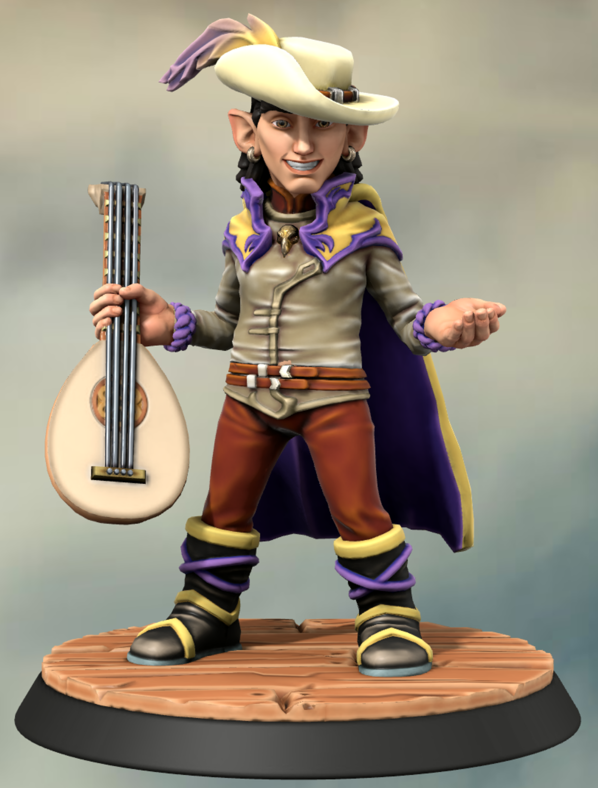

# Komal Re

## Background
Backgrounds are being kept private for the time being. If anyone wants me to edit anything, just DM me and I can add it.

## Roleplaying Characteristics
Komal is quick to throw an insult and loves to *think* he’s wittier than he is. These kinds of interactions with people can go well in a drunk crowd or it could go completely off the rails. He hasn’t really learned his lesson yet and continues to be the same person he’s always been, for now.

Because of his type of comedy, Komal can never stay in one place too long. As we play, I’ll probably try to explore more of Komal’s reasons for being the way he is but this should be a fun place to start.

